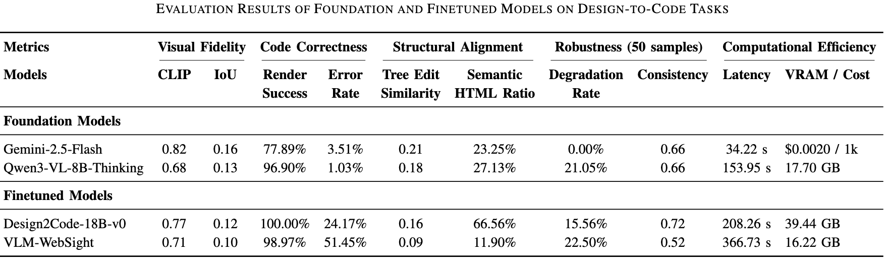

# [Scaling LLM Project] Design2Code at Scale: A Framework-Based Comparison of Lightweight Fine-Tuning and Zero-Shot VLMs

> **📦 [Dataset Release](https://github.com/jiayiichen/Design2Code-Predictions)** | **📝 [Blog Post](blog.md)**

## Team Information

- **Team Name**: Design2Code at Scale
- **Members**:
  - Chunyu Jin (cj2871)
  - Shuyang Yu (sy3309)
  - Jiayi Chen (jc6683)

---

## 1. Problem Statement

How should practitioners choose between general-purpose VLM and specialized fine-tuned models for automatic UI-to-code generation?

---

## 2. Model Description

We evaluate four Vision-Language Models (VLMs) on design-to-code generation:

### Foundation Models (Zero-Shot)
- **Gemini-2.5-Flash**: Google's multimodal model accessed via API, capable of processing design images and generating HTML/CSS code without task-specific training.
- **Qwen3-VL-8B-Thinking**: Open-source 8B parameter VLM from Alibaba with enhanced reasoning capabilities, run locally on GPU.

### Fine-tuned Models
- **Design2Code-18B-v0**: An 18B parameter model fine-tuned specifically on design-to-code tasks, based on CogVLM architecture.
- **VLM-WebSight**: A VLM fine-tuned on the WebSight dataset for HTML generation from webpage screenshots.

### Framework and Implementation
- **Framework**: PyTorch 2.8.0, HuggingFace Transformers 4.57.1
- **Hardware**: NVIDIA A100 GPU (80GB VRAM)
- **Dataset**: [SALT-NLP/Design2Code-hf](https://huggingface.co/datasets/SALT-NLP/Design2Code-hf) (484 samples)

---

## 3. Final Results Summary

### Evaluation Results



### Key Metrics
- **Visual Fidelity**: CLIP similarity and IoU between rendered output and reference
- **Code Correctness**: Render success rate and syntax error rate
- **Structural Alignment**: DOM tree edit similarity and semantic HTML tag usage
- **Robustness**: Performance degradation under image perturbations (50 samples)
- **Computational Efficiency**: Inference latency and memory/cost requirements

---

## 4. Reproducibility Instructions

### A. Requirements

Install dependencies:

```bash
pip install -r requirements.txt

# Install Playwright browsers (required for rendering)
playwright install chromium
```

---

### B. Project Structure

```
Design2code/
├── metrics/                    # Evaluation metrics implementation
│   ├── CLIP.py                # Visual fidelity (CLIP similarity)
│   ├── IOU.py                 # Visual fidelity (IoU)
│   ├── structural_alignment.py # Tree edit distance & semantic HTML
│   ├── correctness.py         # Render success & error detection
│   ├── efficiency.py          # Latency and resource metrics
│   └── robustness.py          # Degradation rate calculation
│
├── gemini/                     # Gemini API integration
│   ├── gemini.py              # Main Gemini inference script
│   ├── evaluate_efficiency.py
│   └── evaluate_structural_alignment.py
│
├── design2code-18b-v0/         # Design2Code-18B model evaluation
│   ├── evaluate_efficiency.py
│   └── evaluate_structural_alignment.py
│
├── run_Qwen&Websight/          # Qwen and WebSight inference scripts
│   ├── evaluate_qwen.py
│   └── evaluate_websight.py
│
├── eval_Qwen&Websight/         # Evaluation notebooks
│   ├── run_metric_qwen.ipynb
│   └── run_metric_websight.ipynb
│
├── QwenWebSight_setup/         # Model setup and configuration
│   ├── model_setup.ipynb
│   ├── evaluate_models.py
│   └── requirements.txt
│
├── robustness/                 # Robustness testing pipeline
│   ├── test_robustness.py     # Main robustness test script
│   ├── test_robustness_gemini.py
│   ├── test_robustness_design2code18b.py
│   ├── robustness_analysis.ipynb
│   └── robustness_results/    # Test results
│
├── agent/                      # Automated repair agent
│   ├── langchain_agent.py
│   ├── repair_agent.py
│   └── run_agent.sh
│
├── results_Qwen/              # Qwen model predictions (484 samples)
├── results_WebSight/          # WebSight model predictions (484 samples)
├── results_Design2Code18B/    # Design2Code predictions (50 samples)
│
├── imgs/                      # Visualization images
├── visualization.ipynb        # Results visualization notebook
├── dataset.py                 # Dataset loading utilities
├── prompt.txt                 # Prompt template
└── requirements.txt           # Python dependencies
```

---

### C. Running Inference

**Qwen3-VL-8B & WebSight:**
```bash
cd run_Qwen&Websight/
python evaluate_qwen.py
python evaluate_websight.py
```

**Gemini-2.5-Flash:**
```bash
cd gemini/
python gemini.py
```

**Design2Code-18B-v0:**
See `QwenWebSight_setup/model_setup.ipynb` for model setup instructions.

---

### D. Evaluation

Run evaluation metrics on model predictions:

```bash
# Visual Fidelity (CLIP Score)
python metrics/CLIP.py

# Visual Fidelity (IoU)
python metrics/IOU.py

# Structural Alignment
python metrics/structural_alignment.py

# Code Correctness
python metrics/correctness.py

# Computational Efficiency
python metrics/efficiency.py
```

Model-specific evaluation:
```bash
# Gemini evaluation
cd gemini/
python evaluate_efficiency.py
python evaluate_structural_alignment.py

# Design2Code-18B evaluation
cd design2code-18b-v0/
python evaluate_efficiency.py
python evaluate_structural_alignment.py
```

---

### E. Robustness Testing

To evaluate model robustness under image perturbations:

```bash
cd robustness/

# Test Qwen model
python test_robustness.py --model qwen --samples 50

# Test WebSight model
python test_robustness.py --model websight --samples 50

# Test Gemini model
python test_robustness_gemini.py

# Test Design2Code-18B model
python test_robustness_design2code18b.py
```

Analysis notebook: `robustness/robustness_analysis.ipynb`

---

### F. Automated Repair Agent

To run the automated evaluation and repair agent:

```bash
cd agent/
bash run_agent.sh
```

---

## 5. Notes

- All evaluation results are saved in `results_*/` directories
- The dataset is automatically downloaded from HuggingFace
- For Gemini API usage, ensure Google Cloud credentials are configured
- Visualization notebook: `visualization.ipynb`
- Case study images available in `imgs/` directory
