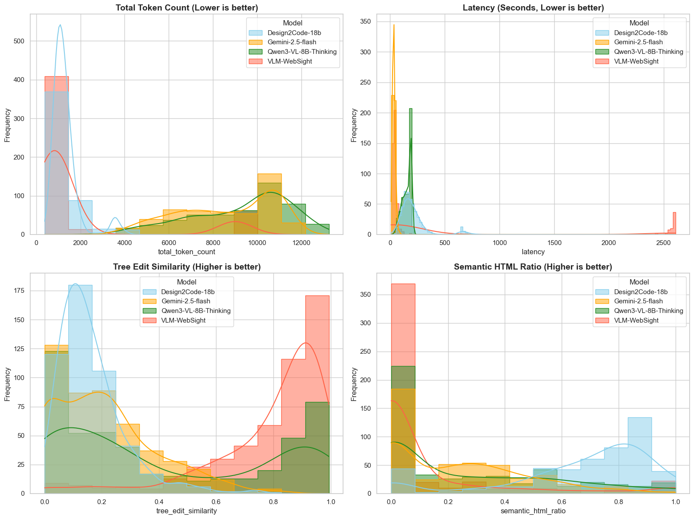

# Design-to-Code at Scale: Why Your AI-Generated Code Looks Great but Fails Engineers

Building a bridge between a UI/UX design and functional code is an area of AI that is both exciting and frustrating. We have all seen a model generate a page that looks perfect—but once you peek under the hood, the code is a mess of nested `
`s that no developer would ever want to maintain.

In our latest research, we decided to look beyond the pretty screenshots and evaluate what's actually happening when Vision-Language Models (VLMs) write code. Here is what we found when we put foundation models like **Gemini 2.5 Flash** up against specialized, fine-tuned models like **Design2Code-18B**.

---

## The 5-Dimension Test: Beyond Just Looking Good

Most benchmarks only care if the output *looks* like the input. But for a developer, that’s only part of the story. We built a unified evaluation framework that measures five critical axes:

- **Visual Fidelity**: Does it match the design?
- **Structural Alignment**: Is the DOM tree logical, or just a random pile of elements?
- **Code Correctness**: Does it actually render without crashing?
- **Robustness**: Does the model panic if the screenshot is a bit blurry or cropped?
- **Efficiency**: How much does it cost, and how long do we have to wait?

---

## The Great Trade-off: Aesthetics vs. Engineering

Our testing revealed a clear performance divergence between general-purpose models and specialists. To truly understand why a model might *look* good but *feel* bad to a developer, we need to look at **distributions**, not just averages.

### Figure 1: Comparison of Key Metrics Distribution across four major models

The charts reveal consistent patterns:

- **The Token Gap**: Gemini (yellow) peaks at high token counts, while Design2Code-18B (light blue) stays lean. Foundation models often over-write code to achieve visual precision.
- **The Semantic Shift**: Design2Code-18B is the only model consistently pushing into the **0.8–1.0** Semantic HTML Ratio range, while others cluster in the low-semantic zone.

Choosing a model isn't just about “highest score.” If you need a quick mockup for a meeting, you want low latency. If you’re handing code to an engineer for production, you want semantic richness and maintainability.

---

## Figure 1 Takeaways by Model Family

### 1) The Foundation Models (The Speed Demons)

Models like **Gemini-2.5-Flash** are champions of visual fidelity: they achieve the highest CLIP scores (**0.82**) and are fast (**34 seconds per page**).

They often achieve pixel-level similarity by relying on:

- **Verbosity**: generating **10,000+ tokens** for a simple layout
- **Div-Soup**: replacing meaningful tags (like `<nav>` or `<header>`) with endless nested `
` tags

### 2) The Fine-Tuned Specialists (The Architects)

Models like **Design2Code-18B-v0** prioritize the code over the pixel. While visual similarity may be slightly lower, code quality is significantly higher:

- **Semantic Ratio**: **66.56%** semantic HTML5 usage vs. **~23%** for foundation models
- **Reliability**: **100% render success rate** in our tests

---

## Which Model Should You Use?

Based on our **2025** benchmarks, the “best” model depends on where you are in the development lifecycle:

| Use Case | Recommended Model | Why? |
|---|---|---|
| Rapid Prototyping | Gemini-2.5-Flash | Extreme speed and high visual accuracy for stakeholders. |
| Production Code | Design2Code-18B | Compact, maintainable, and accessible code structure. |
| Local Deployment | Qwen3-VL-8B | Balanced performance with low VRAM requirements (**17.7 GB**). |

---

## Closing the Gap: The Automated Repair Agent

Even strong models make mistakes. To reduce manual cleanup, we implemented an **Automated Repair Agent** that runs a simple loop:

**Render → Evaluate (quality gates) → Repair (targeted edits)**

How it works:
- Render the HTML and capture console/page errors
- Evaluate quality gates (e.g., semantic ratio, structural checks)
- If quality is too low, send the code back with specific repair instructions
- Iterate until the output is “good enough” for engineering handoff

By using evaluation metrics as **quality gates**, we can transform messy, shallow HTML into production-ready code with minimal human intervention.

---

## Final Thoughts

Design-to-code isn’t just about vision anymore—it’s about **structural integrity**. As we move further into 2025, the goal is no longer just making a screenshot look like a website; it’s generating code that a developer would be happy to commit.

**Want to dive deeper?**  
- Repository: *[GitHub - Scaling LLM](https://github.com/ysy2003/ScalingLLMs)*  
- Benchmark results: *Design2Code results*
